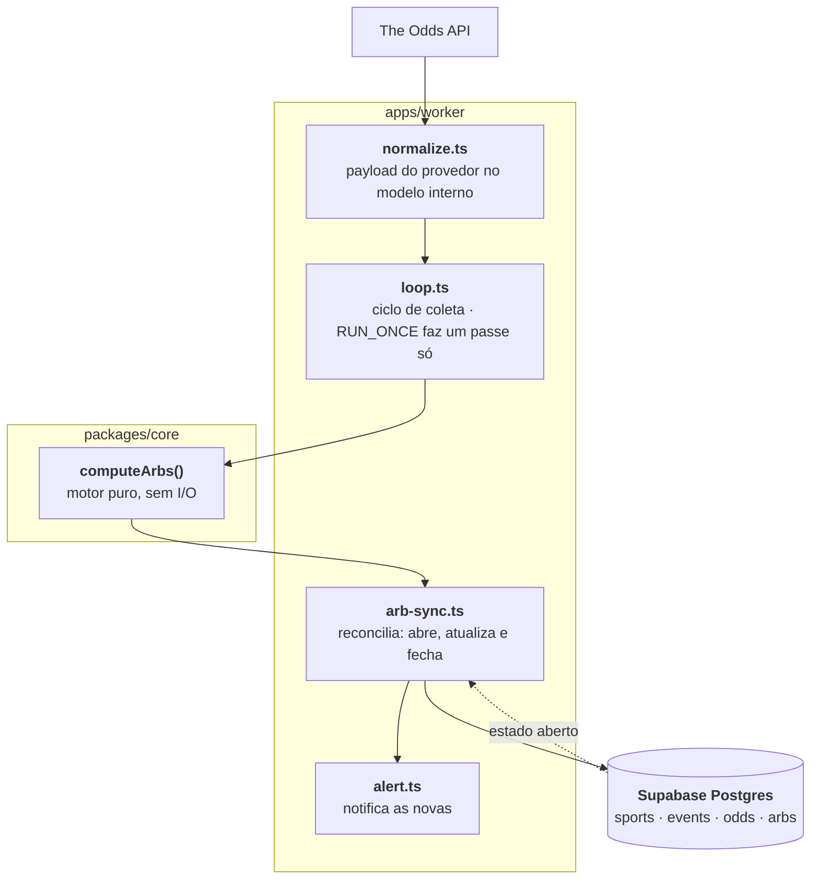

<div align="center">

# 📈 surebet-api

**Scanner de arbitragem esportiva pre-match — motor puro, worker de coleta e Postgres**

<a href="#"></a>
<a href="#"></a>
<a href="#"></a>
<a href="#"></a>
<a href="#"></a>
<a href="#"></a>

[Como detecta](#-como-a-detecção-funciona) · [A parte difícil](#-a-parte-difícil-agrupar-a-linha-certa) · [Arquitetura](#️-arquitetura) · [Rodar local](#-rodar-local)

`Motor puro e testável` · `Worker idempotente` · `Fase 1 rodando com arbitragens reais detectadas`

</div>

---

## 🎯 O que é

Uma **surebet** existe quando as cotações de casas diferentes para o mesmo evento, somadas
em probabilidade implícita, dão **menos de 1** — nesse caso há uma distribuição de banca que
retorna lucro qualquer que seja o resultado.

Este projeto coleta odds de provedores autorizados, detecta essas oportunidades e mantém uma
tabela de arbitragens vivas no Postgres.

> [!WARNING]
> Oportunidade matemática **não é garantia de lucro**. Odds mudam em segundos, mercados são
> suspensos, casas aplicam limites e o arredondamento pode comer a margem inteira.
> Verifique a legislação local e os termos de cada plataforma.

## 🧮 Como a detecção funciona

O motor (`packages/core`) é uma função pura: recebe odds normalizadas, devolve arbitragens.
Sem I/O, sem banco, sem relógio — o que o torna trivialmente testável.

```ts
export function computeArbs(odds: NormalizedOdd[]): Arb[]
```

O fluxo é agrupar → validar forma → calcular margem:

1. Agrupa por `eventId | market | linha`
2. Confere se o grupo tem **exatamente** o conjunto de resultados esperado do mercado
3. Soma as probabilidades implícitas (`1/odd`) do melhor preço de cada resultado
4. Se a soma for `< 1`, é arbitragem — calcula a distribuição da banca

O passo 2 é o que evita alarme falso. Cada mercado tem uma forma própria, e futebol tem empate:

```ts
case 'h2h':
  return first.sportKey.startsWith('soccer')
    ? new Set([first.homeTeam, first.awayTeam, 'Draw'])
    : new Set([first.homeTeam, first.awayTeam]);
```

Mercado de forma desconhecida retorna `null` — o motor prefere **não detectar** a arriscar
uma arbitragem falsa.

## 🧩 A parte difícil: agrupar a linha certa

Em handicap (`spreads`), a linha precisa ser **assinada em relação ao mandante**. Agrupar pelo
valor absoluto parece funcionar e está errado:

```ts
case 'spreads':
  // linha assinada relativa ao mandante: só linhas complementares (favorito
  // e azarão do mesmo confronto) caem no mesmo grupo. Usar |point| juntava
  // "Lakers -2.5" com "Celtics -2.5" (favoritos opostos) na mesma chave.
  return odd.outcome === odd.homeTeam ? odd.point : -odd.point;
```

Com `|point|`, "Lakers -2.5" e "Celtics -2.5" — dois **favoritos opostos**, que nunca formam
um par complementar — caíam na mesma chave e produziam arbitragem fantasma.

## 🏗️ Arquitetura



O `arb-sync` é **reconciliador, não append-only**: a cada ciclo ele compara o que o motor
devolveu com o que está aberto no banco, e fecha o que sumiu. Sem isso a tabela encheria de
arbitragens mortas que a interface mostraria como vivas.

Chave primária de `odds` é composta (`event_id, bookmaker, market, outcome, point`), então
recoletar o mesmo ciclo é idempotente.

## 📁 Estrutura

```
packages/core/          motor de arbitragem puro (computeArbs) + tipos
apps/worker/            coleta no The Odds API, normalização, sync e alerta
supabase/migrations/    schema: sports, events, odds, arbs
docs/superpowers/       spec de design e plano da fase 1
```

## 🚀 Rodar local

```bash
pnpm install && pnpm build
cp apps/worker/.env.example apps/worker/.env   # preencher
RUN_ONCE=1 pnpm --filter @surebet/worker dev   # um único ciclo
```

No PowerShell:

```powershell
$env:RUN_ONCE='1'; pnpm --filter @surebet/worker dev
```

## 🧪 Testes

```bash
pnpm test
```

Vitest em todos os pacotes. O motor tem teste próprio com fixture real do provedor
(`apps/worker/test/fixtures/odds-api-soccer.json`), então mudança de formato do payload
quebra o teste em vez de quebrar a produção.

## 🚢 Deploy (VPS + pm2)

```bash
pnpm install && pnpm build
cd apps/worker && pm2 start ecosystem.config.cjs
```

O `.env` de `apps/worker/` é carregado pelo próprio app no boot (`process.loadEnvFile`),
então funciona igual com `pnpm dev` e com pm2 — ambos rodam com cwd em `apps/worker`.

## 🗺️ Estado

- ✅ **Fase 1** — motor, worker, schema e sync em produção, com arbitragens reais detectadas
- 🔜 **Fase 2** — API pública v1

## 🧱 Stack

`TypeScript` · `Node.js` · `pnpm workspace` · `Supabase / Postgres` · `Vitest` · `pm2`
